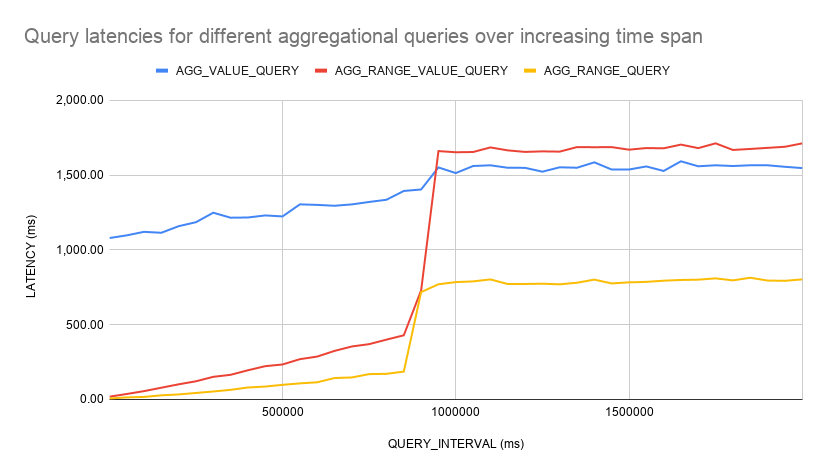
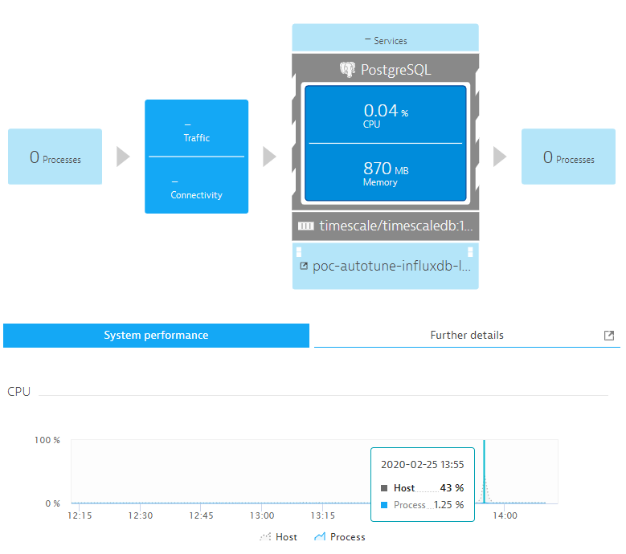
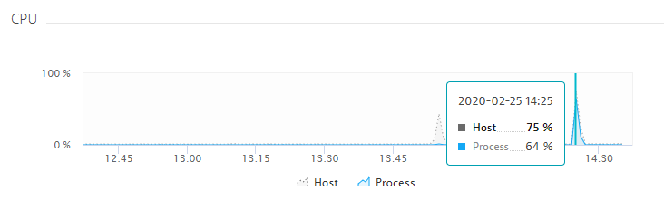

# Continuous Aggregates Experiments (TimescaleDB)

When querying time-ranges, query latency increases over increasing time spans. This expected behavior can be seen in the figure below:



Test List:
- AGG_TEST_01: No continuous queries specified. Ingestion test, query test with increasing query_interval

## AGG_TEST_01

First results as follows:

| "id" | "CLIENT\_NUMBER" | "GROUP\_NUMBER" | "DEVICE\_NUMBER" | "SENSOR\_NUMBER" | "BATCH\_SIZE" | "LOOP\_RATE" | "REAL\_INSERT\_RATE" | "POINT\_STEP" | "INGESTION\_THROUGHPUT" |
|------|------------------|-----------------|------------------|------------------|---------------|--------------|----------------------|---------------|-------------------------|
| "5"  | "20"             | "20"            | "20"             | "300"            | "100"         | "10"         | "1"                  | "5000"        | "150515\.6"             |
| "2"  | "20"             | "20"            | "20"             | "300"            | "100"         | "20"         | "1"                  | "5000"        | "120539\.77"            |

Ingestion Throughput for 12000000 points with no continuous aggregates present is at 120539.77 points per second. For 6000000 points even only at 117169.53 points per sec.

For query_interval of 2000000 (= 2000 sec or 33.3 min), the average latencies are: AGG_RANGE 113.90, AGG_VALUE 797.14 and AGG_RANGE_VALUE 317.38 (ms).

Now introduce continuous aggregate on query like

```sql
-- aggRangeQuery like:
EXPLAIN ANALYZE -- will show how long the query executed
SELECT device, count(s_214) FROM benchmark WHERE (device='d_1') 
    AND (time >= 1579449640000 and time <= 1580054440000) -- time range of one week
    GROUP BY device
```

results in:
```
                                                            QUERY PLAN
----------------------------------------------------------------------------------------------------------------------------------
 GroupAggregate  (cost=0.00..28202.55 rows=200 width=12) (actual time=35.183..35.183 rows=1 loops=1)
   Group Key: _hyper_1_1_chunk.device
   ->  Append  (cost=0.00..28180.60 rows=3988 width=12) (actual time=0.096..34.653 rows=3976 loops=1)
         ->  Seq Scan on _hyper_1_1_chunk  (cost=0.00..28180.60 rows=3988 width=12) (actual time=0.095..34.290 rows=3976 loops=1)
               Filter: (("time" >= '1579449640000'::bigint) AND ("time" <= '1580054440000'::bigint) AND (device = 'd_1'::text))
               Rows Removed by Filter: 76024
 Planning time: 0.657 ms
 Execution time: 35.221 ms
(8 rows)
```

Because the table saves time in BIGINT in millis since epoch, its hypertable time column needs to be set with an integer_now function before issuing the continuous aggregate: 

```sql
CREATE OR REPLACE FUNCTION unix_now() returns BIGINT LANGUAGE SQL STABLE as $$ SELECT (extract(epoch from now()) * 1000) ::BIGINT $$;

SELECT set_integer_now_func('benchmark', 'unix_now');
```

the continuous aggregate will look like:
```sql
CREATE VIEW device_summary
WITH (timescaledb.continuous) --This flag is what makes the view continuous
AS
SELECT
  time_bucket('60000', time) as bucket, --time_bucket is required, bucket will be of integer, as timestamp is in BIGINT. 60000 = 1 min
  device,
  count(s_214) as metric_count --We can use any parallelizable aggregate
FROM
  benchmark
GROUP BY bucket, device; --We have to group by the bucket column, but can also add other group-by columns
```

results in 

```
NOTICE:  adding index _materialized_hypertable_2_device_bucket_idx ON _timescaledb_internal._materialized_hypertable_2 USING BTREE(device, bucket)
```

The original query will then not experience any performance improvements. Instead, the view needs to be called explicitly like

```sql
EXPLAIN ANALYZE -- will show how long the query executed
SELECT * FROM device_summary
WHERE device = 'd_1'
  AND bucket >= '1579449640000' AND bucket < '1580054440000'; -- time format like  2020-02-25 13:08:39.912372+00
```

this resulted in the following analyze statement:

```
                                                                                      QUERY PLAN
--------------------------------------------------------------------------------------------------------------------------------------------------------------------------------------
 HashAggregate  (cost=33.75..35.82 rows=166 width=20) (actual time=0.390..0.428 rows=166 loops=1)
   Group Key: _hyper_2_2_chunk.bucket, _hyper_2_2_chunk.device
   ->  Append  (cost=4.60..32.50 rows=166 width=21) (actual time=0.041..0.150 rows=166 loops=1)
         ->  Bitmap Heap Scan on _hyper_2_2_chunk  (cost=4.60..32.50 rows=166 width=21) (actual time=0.041..0.135 rows=166 loops=1)
               Recheck Cond: ((device = 'd_1'::text) AND (bucket >= '1579449640000'::bigint) AND (bucket < '1580054440000'::bigint))
               Heap Blocks: exact=25
               ->  Bitmap Index Scan on _hyper_2_2_chunk__materialized_hypertable_2_device_bucket_idx  (cost=0.00..4.56 rows=166 width=0) (actual time=0.032..0.032 rows=166 loops=1)
                     Index Cond: ((device = 'd_1'::text) AND (bucket >= '1579449640000'::bigint) AND (bucket < '1580054440000'::bigint))
 Planning time: 0.331 ms
 Execution time: 0.512 ms
(10 rows)
```

So execution time for the count statement could be reduced from 35.221 ms to 0.512 ms.

When setting up the continuous aggregate query, peak CPU consumption rose to 43% for a short period of time:



After issuing this one continuous aggregate (with vanilla settings), ingestion performed as follows:

| "id" | "CLIENT\_NUMBER" | "GROUP\_NUMBER" | "DEVICE\_NUMBER" | "SENSOR\_NUMBER" | "BATCH\_SIZE" | "LOOP\_RATE" | "REAL\_INSERT\_RATE" | "POINT\_STEP" | "INGESTION\_THROUGHPUT" |
|------|------------------|-----------------|------------------|------------------|---------------|--------------|----------------------|---------------|-------------------------|
| "5"  | "20"             | "20"            | "20"             | "300"            | "100"         | "10"         | "1"                  | "5000"        | "122117.04"             |

So no real difference concerning ingestion throughput, but with vanilla settings (optimized to not amplify ingestion latency).

Therefore, I tuned the hyperparameters to a more real-time continuous aggregate scenario like so. From 12 hours to 5 sec refresh interval and from 120000 ms to 5000 ms refresh_lag.

```sql
ALTER VIEW device_summary SET (timescaledb.refresh_interval = '5 sec');
ALTER VIEW device_summary SET (timescaledb.refresh_lag = '5000');
```

When altering these settings, the recalculation of the view was performed immediately because intermediate new data was inserted.



After altering the view, I reran the ingestion scenario. This was the result:

| "id" | "CLIENT\_NUMBER" | "GROUP\_NUMBER" | "DEVICE\_NUMBER" | "SENSOR\_NUMBER" | "BATCH\_SIZE" | "LOOP\_RATE" | "REAL\_INSERT\_RATE" | "POINT\_STEP" | "INGESTION\_THROUGHPUT" |
|------|------------------|-----------------|------------------|------------------|---------------|--------------|----------------------|---------------|-------------------------|
| "5"  | "20"             | "20"            | "20"             | "300"            | "100"         | "10"         | "1"                  | "5000"        | "121782.17"             |

A bit lower but not really significant.

Let's change the benchmark settings to be more appropriate for measuring this behavior (only one sensor and only inserting for this one):

# Util

Get information about background jobs concerning continuous aggregates:
```sql
select * from timescaledb_information.continuous_aggregate_stats;
```