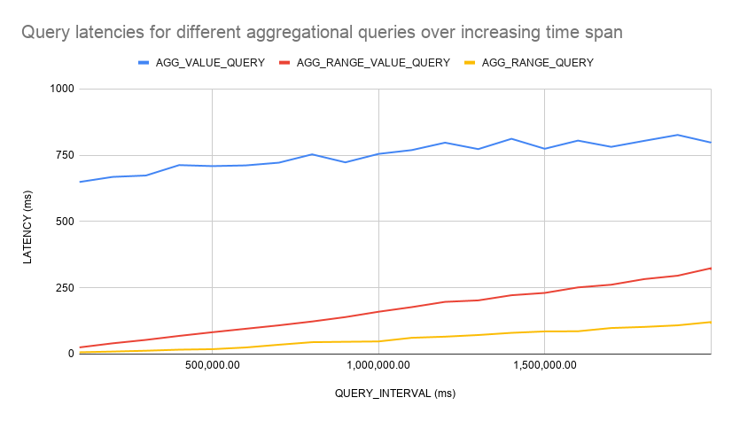
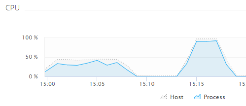
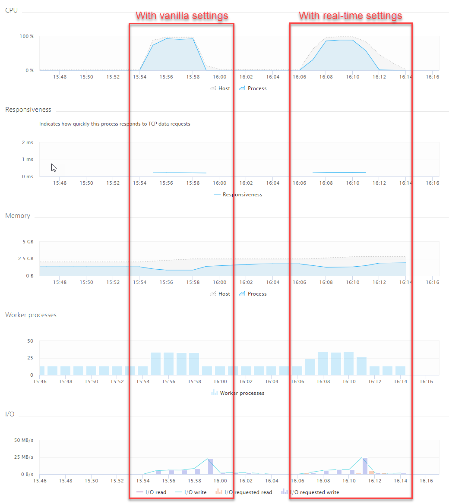

# Continuous Aggregates Experiments (TimescaleDB)

When querying time-ranges, query latency increases over increasing time spans. This expected behavior can be seen in the figure below:



Test List:
- AGG_TEST_01: No continuous queries specified. Ingestion test, query test with increasing query_interval

## AGG_TEST_01

First results as follows:

| "id" | "CLIENT\_NUMBER" | "GROUP\_NUMBER" | "DEVICE\_NUMBER" | "SENSOR\_NUMBER" | "BATCH\_SIZE" | "LOOP\_RATE" | "REAL\_INSERT\_RATE" | "POINT\_STEP" | "INGESTION\_THROUGHPUT" |
|------|------------------|-----------------|------------------|------------------|---------------|--------------|----------------------|---------------|-------------------------|
| "5"  | "20"             | "20"            | "20"             | "300"            | "100"         | "10"         | "1"                  | "5000"        | "150515\.6"             |
| "2"  | "20"             | "20"            | "20"             | "300"            | "100"         | "20"         | "1"                  | "5000"        | "120539\.77"            |

Ingestion Throughput for 12000000 points with no continuous aggregates present is at 120539.77 points per second. For 6000000 points even only at 117169.53 points per sec.

For query_interval of 2000000 (= 2000 sec or 33.3 min), the average latencies are: AGG_RANGE 113.90, AGG_VALUE 797.14 and AGG_RANGE_VALUE 317.38 (ms).

Now introduce continuous aggregate on query like

```sql
-- aggRangeQuery like:
EXPLAIN ANALYZE -- will show how long the query executed
SELECT device, count(s_214) FROM benchmark WHERE (device='d_1') 
    AND (time >= 1579449640000 and time <= 1580054440000) -- time range of one week
    GROUP BY device
```

results in:
```
                                                            QUERY PLAN
----------------------------------------------------------------------------------------------------------------------------------
 GroupAggregate  (cost=0.00..28202.55 rows=200 width=12) (actual time=35.183..35.183 rows=1 loops=1)
   Group Key: _hyper_1_1_chunk.device
   ->  Append  (cost=0.00..28180.60 rows=3988 width=12) (actual time=0.096..34.653 rows=3976 loops=1)
         ->  Seq Scan on _hyper_1_1_chunk  (cost=0.00..28180.60 rows=3988 width=12) (actual time=0.095..34.290 rows=3976 loops=1)
               Filter: (("time" >= '1579449640000'::bigint) AND ("time" <= '1580054440000'::bigint) AND (device = 'd_1'::text))
               Rows Removed by Filter: 76024
 Planning time: 0.657 ms
 Execution time: 35.221 ms
(8 rows)
```

Because the table saves time in BIGINT in millis since epoch, its hypertable time column needs to be set with an integer_now function before issuing the continuous aggregate: 

```sql
CREATE OR REPLACE FUNCTION unix_now() returns BIGINT LANGUAGE SQL STABLE as $$ SELECT (extract(epoch from now()) * 1000) ::BIGINT $$;

SELECT set_integer_now_func('benchmark', 'unix_now');
```

the continuous aggregate will look like:
```sql
CREATE VIEW device_summary
WITH (timescaledb.continuous) --This flag is what makes the view continuous
AS
SELECT
  time_bucket('60000', time) as bucket, --time_bucket is required, bucket will be of integer, as timestamp is in BIGINT. 60000 = 1 min
  device,
  count(s_214) as metric_count --We can use any parallelizable aggregate
FROM
  benchmark
GROUP BY bucket, device; --We have to group by the bucket column, but can also add other group-by columns
```

results in 

```
NOTICE:  adding index _materialized_hypertable_2_device_bucket_idx ON _timescaledb_internal._materialized_hypertable_2 USING BTREE(device, bucket)
```

The original query will then not experience any performance improvements. Instead, the view needs to be called explicitly like

```sql
EXPLAIN ANALYZE -- will show how long the query executed
SELECT * FROM device_summary
WHERE device = 'd_1'
  AND bucket >= '1579449640000' AND bucket < '1580054440000'; -- time format like  2020-02-25 13:08:39.912372+00
```

this resulted in the following analyze statement:

```
                                                                                      QUERY PLAN
--------------------------------------------------------------------------------------------------------------------------------------------------------------------------------------
 HashAggregate  (cost=33.75..35.82 rows=166 width=20) (actual time=0.390..0.428 rows=166 loops=1)
   Group Key: _hyper_2_2_chunk.bucket, _hyper_2_2_chunk.device
   ->  Append  (cost=4.60..32.50 rows=166 width=21) (actual time=0.041..0.150 rows=166 loops=1)
         ->  Bitmap Heap Scan on _hyper_2_2_chunk  (cost=4.60..32.50 rows=166 width=21) (actual time=0.041..0.135 rows=166 loops=1)
               Recheck Cond: ((device = 'd_1'::text) AND (bucket >= '1579449640000'::bigint) AND (bucket < '1580054440000'::bigint))
               Heap Blocks: exact=25
               ->  Bitmap Index Scan on _hyper_2_2_chunk__materialized_hypertable_2_device_bucket_idx  (cost=0.00..4.56 rows=166 width=0) (actual time=0.032..0.032 rows=166 loops=1)
                     Index Cond: ((device = 'd_1'::text) AND (bucket >= '1579449640000'::bigint) AND (bucket < '1580054440000'::bigint))
 Planning time: 0.331 ms
 Execution time: 0.512 ms
(10 rows)
```

So execution time for the count statement could be reduced from 35.221 ms to 0.512 ms.

When setting up the continuous aggregate query, peak CPU consumption rose to 43% for a short period of time:


After issuing this one continuous aggregate (with vanilla settings), ingestion performed as follows:

| "id" | "CLIENT\_NUMBER" | "GROUP\_NUMBER" | "DEVICE\_NUMBER" | "SENSOR\_NUMBER" | "BATCH\_SIZE" | "LOOP\_RATE" | "REAL\_INSERT\_RATE" | "POINT\_STEP" | "INGESTION\_THROUGHPUT" |
|------|------------------|-----------------|------------------|------------------|---------------|--------------|----------------------|---------------|-------------------------|
| "5"  | "20"             | "20"            | "20"             | "300"            | "100"         | "10"         | "1"                  | "5000"        | "122117.04"             |

So no real difference concerning ingestion throughput, but with vanilla settings (optimized to not amplify ingestion latency).

Therefore, I tuned the hyperparameters to a more real-time continuous aggregate scenario like so. From 12 hours to 5 sec refresh interval and from 120000 ms to 5000 ms refresh_lag.

```sql
ALTER VIEW device_summary SET (timescaledb.refresh_interval = '5 sec');
ALTER VIEW device_summary SET (timescaledb.refresh_lag = '5000');
```

When altering these settings, the recalculation of the view was performed immediately because intermediate new data was inserted.


After altering the view, I reran the ingestion scenario. This was the result:

| "id" | "CLIENT\_NUMBER" | "GROUP\_NUMBER" | "DEVICE\_NUMBER" | "SENSOR\_NUMBER" | "BATCH\_SIZE" | "LOOP\_RATE" | "REAL\_INSERT\_RATE" | "POINT\_STEP" | "INGESTION\_THROUGHPUT" |
|------|------------------|-----------------|------------------|------------------|---------------|--------------|----------------------|---------------|-------------------------|
| "5"  | "20"             | "20"            | "20"             | "300"            | "100"         | "10"         | "1"                  | "5000"        | "121782.17"             |

A bit lower but not really significant.

Let's change the benchmark settings to be more appropriate for measuring this behavior (only one sensor and only inserting for this one). This low cardinality is very much not ideal for timescaledb, as CPU load in this scenario is very high! Almost 100% all the time the ingestion test ran.

| "id" | "CLIENT\_NUMBER" | "GROUP\_NUMBER" | "DEVICE\_NUMBER" | "SENSOR\_NUMBER" | "BATCH\_SIZE" | "LOOP\_RATE" | "REAL\_INSERT\_RATE" | "POINT\_STEP" | "INGESTION\_THROUGHPUT" |
|------|------------------|-----------------|------------------|------------------|---------------|--------------|----------------------|---------------|-------------------------|
| "6"  | "20"             | "1"             | "1"              | "1"              | "5000"        | "50"         | "1"                  | "5000"        | "21642.48"              |



Now execute the following aggRange query:

```sql
-- aggRangeQuery like:
EXPLAIN ANALYZE -- will show how long the query executed
SELECT device, count(s_0) FROM agg_test_04 WHERE (device='d_0') 
    AND (time >= 1579449640000 and time <= 1580054440000) -- time range of one week
    GROUP BY device
```
Count will measure 120961 data points within that time span but needed to count them all from the raw data. Analyze query results in the following:

```
                                                                                    QUERY PLAN
-----------------------------------------------------------------------------------------------------------------------------------------------------------------------------------
 GroupAggregate  (cost=0.42..4857.66 rows=200 width=12) (actual time=45.801..45.801 rows=1 loops=1)
   Group Key: _hyper_4_93_chunk.device
   ->  Append  (cost=0.42..4250.86 rows=120960 width=12) (actual time=0.014..34.376 rows=120961 loops=1)
         ->  Index Scan using _hyper_4_93_chunk_agg_test_04_time_idx on _hyper_4_93_chunk  (cost=0.42..2224.05 rows=63369 width=12) (actual time=0.013..14.496 rows=63369 loops=1)
               Index Cond: (("time" >= '1579449640000'::bigint) AND ("time" <= '1580054440000'::bigint))
               Filter: (device = 'd_0'::text)
         ->  Index Scan using _hyper_4_92_chunk_agg_test_04_time_idx on _hyper_4_92_chunk  (cost=0.42..2026.82 rows=57591 width=12) (actual time=0.018..12.364 rows=57592 loops=1)
               Index Cond: (("time" >= '1579449640000'::bigint) AND ("time" <= '1580054440000'::bigint))
               Filter: (device = 'd_0'::text)
 Planning time: 0.539 ms
 Execution time: 50.603 ms
(11 rows)
```

Build continuous aggregate on this:

```sql
CREATE VIEW device_count
WITH (timescaledb.continuous) --This flag is what makes the view continuous
AS
SELECT
  time_bucket('60000', time) as bucket, --time_bucket is required, bucket will be of integer, as timestamp is in BIGINT. 60000 = 1 min
  device,
  count(s_0) as metric_count --We can use any parallelizable aggregate
FROM
  agg_test_04
GROUP BY bucket, device; --We have to group by the bucket column, but can also add other group-by columns
```

Now explicitly query the view:

```sql
EXPLAIN ANALYZE -- will show how long the query executed
SELECT SUM(metric_count) FROM device_count
WHERE device = 'd_0'
  AND bucket >= '1579449640000' AND bucket < '1580054440000'; -- time format like  2020-02-25 13:08:39.912372+00
```

This will yield 120960 as an aggregated count (off by 1) on the buckets within this time range. Query will execute as fast as:

```
                                                                                                    QUERY PLAN                                                                                                
-------------------------------------------------------------------------------------------------------------------------------------------------------------------------------------------------------------------
 Aggregate  (cost=481.20..481.21 rows=1 width=32) (actual time=23.693..23.693 rows=1 loops=1)
   ->  HashAggregate  (cost=454.52..467.86 rows=1067 width=20) (actual time=20.584..22.926 rows=10080 loops=1)
         Group Key: _hyper_5_133_chunk.bucket, _hyper_5_133_chunk.device
         ->  Append  (cost=0.29..374.49 rows=10671 width=21) (actual time=0.041..5.022 rows=10080 loops=1)
               ->  Index Scan Backward using _hyper_5_133_chunk__materialized_hypertable_5_bucket_idx on _hyper_5_133_chunk  (cost=0.29..374.49 rows=10671 width=21) (actual time=0.040..4.031 rows=10080 loops=1)
                     Index Cond: ((bucket >= '1579449640000'::bigint) AND (bucket < '1580054440000'::bigint))
                     Filter: (device = 'd_0'::text)
 Planning time: 0.626 ms
 Execution time: 19.891 ms
(9 rows)
```
So this will reduce the latency of the count query to something smaller than 1/2 of the original query time. Now re-execute the same ingestion test, yielding the following throughput, which is only marginally lower.

| "id" | "CLIENT\_NUMBER" | "GROUP\_NUMBER" | "DEVICE\_NUMBER" | "SENSOR\_NUMBER" | "BATCH\_SIZE" | "LOOP\_RATE" | "REAL\_INSERT\_RATE" | "POINT\_STEP" | "INGESTION\_THROUGHPUT" |
|------|------------------|-----------------|------------------|------------------|---------------|--------------|----------------------|---------------|-------------------------|
| "6"  | "20"             | "1"             | "1"              | "1"              | "5000"        | "50"         | "1"                  | "5000"        | "20606.45"              |

Now set the hyperparameters to a more real-time aggregation scenario:

```sql
ALTER VIEW device_count SET (timescaledb.refresh_interval = '5 sec');
ALTER VIEW device_count SET (timescaledb.refresh_lag = '5000');
```

And rerun the ingestion benchmark test. Following results:

| "id" | "CLIENT\_NUMBER" | "GROUP\_NUMBER" | "DEVICE\_NUMBER" | "SENSOR\_NUMBER" | "BATCH\_SIZE" | "LOOP\_RATE" | "REAL\_INSERT\_RATE" | "POINT\_STEP" | "INGESTION\_THROUGHPUT" |
|------|------------------|-----------------|------------------|------------------|---------------|--------------|----------------------|---------------|-------------------------|
| "6"  | "20"             | "1"             | "1"              | "1"              | "5000"        | "50"         | "1"                  | "5000"        | "19818.99"              |

Throughput not that different for ingestion but CPU load much higher and stayed high for a longer period of time with many workers recalculating the view:



After more data points have been inserted, the regular SQL query counts 362883 data points for the specified interval while the view query counts 362880 (off by 3). 
- Regular query Execution time: 159.562 ms
- Cont. Agg query Execution time: 21.899 ms

# Util

Get information about background jobs concerning continuous aggregates:
```sql
select * from timescaledb_information.continuous_aggregate_stats;
```