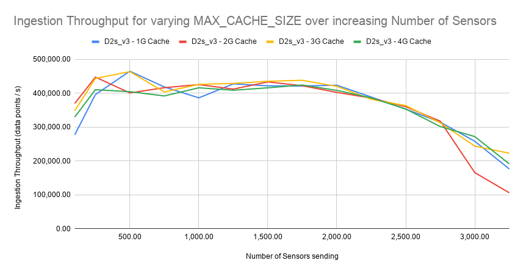
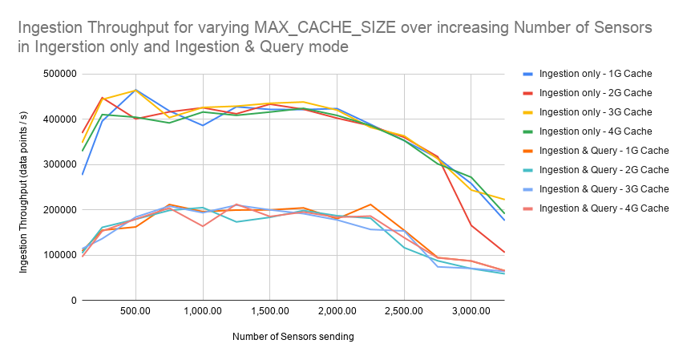
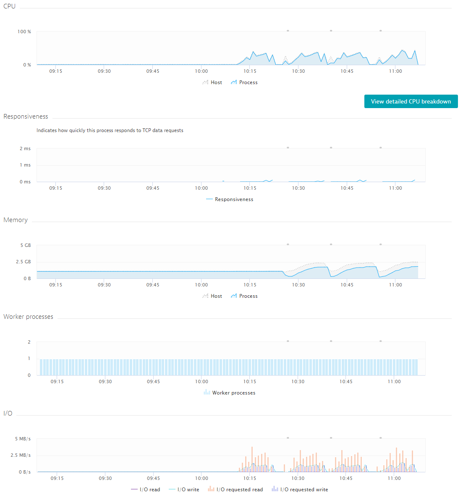

# Ingestion Benchmarks

Ingestion throughput was measured over several different external factors that influence the benchmarking system.

______

So far, the best benchmark configuration in terms of ingestion throughput was the following. Settings on influx were vanilla.

| CLIENT_NUMBER | GROUP_NUMBER | DEVICE_NUMBER | SENSOR_NUMBER | BATCH_SIZE | LOOP_RATE | REAL_INSERT_RATE | POINT_STEP | INGESTION_THROUGHPUT |
|---------------|--------------|---------------|---------------|------------|-----------|------------------|------------|----------------------|
| 20            | 20           | 20            | 300           | 500        | 10        | 1                | 5000       | 480766.96            |

______

The same benchmark (Increase number of sensors sending measurements) was performed on varying influx cache configurations. Hardware used: `B2s - 2 vCPUs & 4 GiB RAM` Variable altered: `INFLUXDB_DATA_CACHE_MAX_MEMORY_SIZE`

Same experiment repeated on larger hardware: `D2s_v3 - 4 vCPUs & 8 GiB RAM`

Repeated the same experiment as in the proposal: Ingestion only vs. Ingestion & Query mode. When the DB is queried at the same time, the optimal external configuration seems to shift to a larger amount of sensors. This could be because the Influx engine will buffer more ingesting requests & perform the queries at the same time. Interestingly, CPU and memory was not an issue and was by far not fully utilized:

